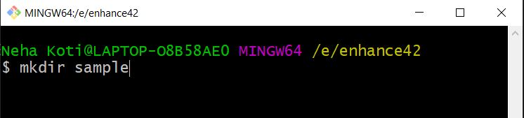
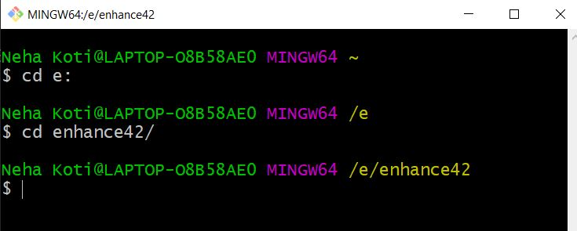
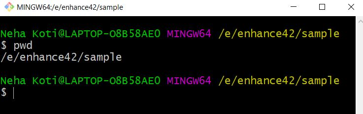

# Basic Unix Commands used in Git

**1. mkdir**

It is used to create directory.  
_Syntax:_ $mkdir name   

_Example:_ $mkdir sample   

**2. cd (change directory)**  
It is used to change the directory from one directory to other.  
_Syntax:_ $cd directoryname

_Example:_ $cd sample  

**3. pwd**  
It displays the present working directory in which user is.  
_Syntax:_ $pwd

_Example:_ $pwd  

  

