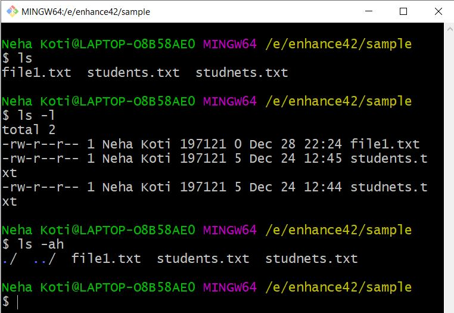
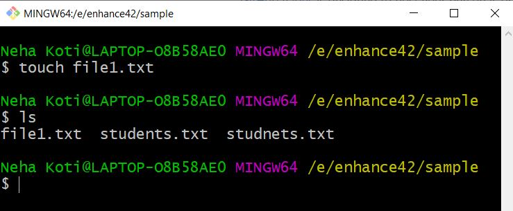
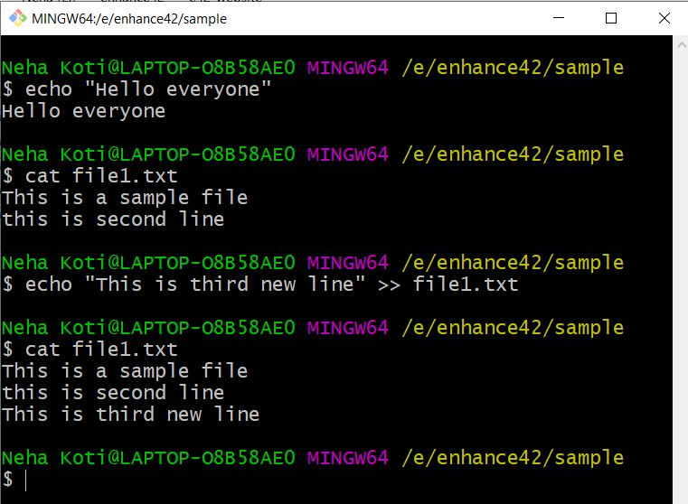

# Second page: Basic commands in Unix

**4. ls**  
- ls: displays list of files and directories of the present working directory.  
- ls -ah: displays list of hidden files.  
- ls -l: displays read write permissions and few other features of files and directories.  

**5. touch**  
Used to create new file.

**6. cat**  
Displays content of the file. And also used to concatinate two iles.  

**6. echo**  
Displays what is written with in doublequotes.And also used to insert text into file.

